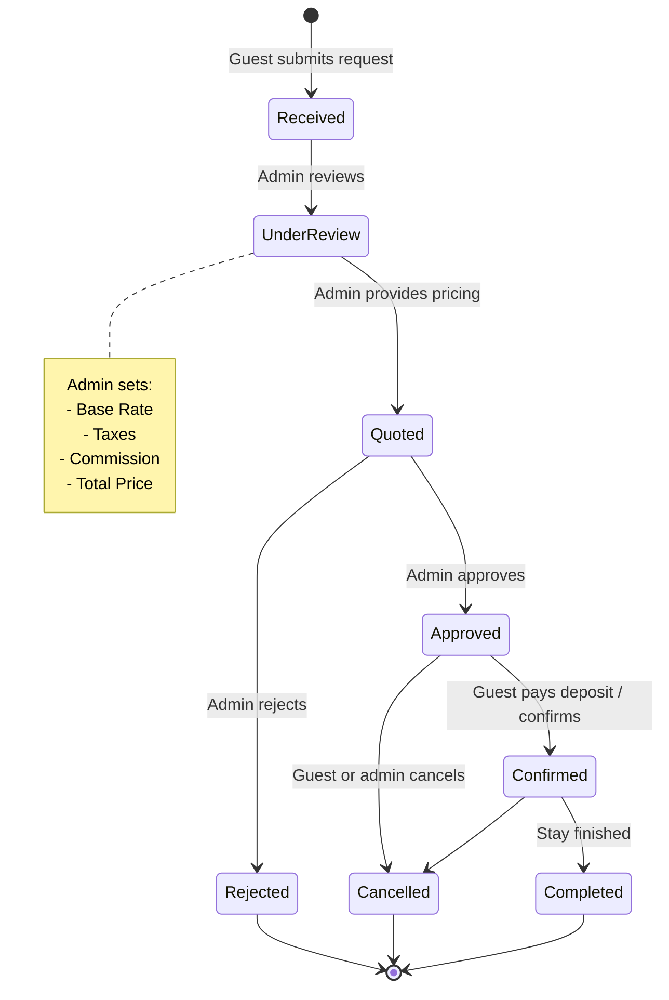
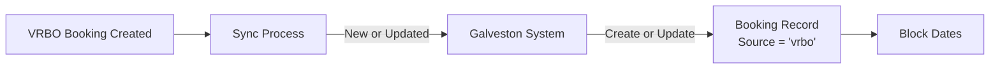

# Galveston Reservation System - Workflow & Integration Design

**Status:** Draft  
**Last Updated:** 2026-05-27  
**Owner:** Howard Shen

---

## 1. Overview & Objectives

This document defines the core workflow, data ownership, and integration strategy for the new Galveston Reservation System.

### Key Objectives

- This system becomes the **authoritative source of truth** for the property (Bayfront Retreat).
- We are no longer dependent on the previous property management company.
- Support two main booking channels:
  - Direct booking requests (via website/form)
  - VRBO bookings (imported from VRBO)
- Admin controls pricing at the point of approval.
- Clear separation of base rate, taxes, and commissions.

---

## 2. Core Principles

| Principle                    | Description |
|-----------------------------|-----------|
| **Source of Truth**         | This system owns availability and booking records. VRBO is treated as a channel, not the source. |
| **Admin Pricing Control**   | Pricing is not shown to guests until the admin reviews and approves the request. |
| **Financial Transparency**  | Every booking must break down into Base Rate + Taxes + Commission. |
| **Channel Agnostic**        | The system should be able to support additional channels (Airbnb, direct, etc.) in the future. |

---

## 3. Integrations

### 3.1 VRBO Integration

**Current Direction** (as of May 2026):
- VRBO bookings will continue to use **VRBO’s own rates and booking process**.
- We will use **bidirectional iCal feeds** for availability synchronization (daily):
  - Import VRBO blocked dates into this system.
  - Export blocked dates from this system back to VRBO.
- **Conflict handling**: Admin will manually resolve any conflicts.
- We prefer to capture guest name + dates from VRBO if available, otherwise we will take whatever the iCal feed provides.

**Goal**: Keep availability in sync so this system can serve as the central source of truth while still allowing VRBO to handle its own bookings and pricing.

See [PRICING_MODEL.md](./PRICING_MODEL.md) for the full current rate structure and detailed fee/tax/commission breakdown.

---

## 4. Booking Lifecycle (Proposed)



### State Definitions (Draft)

| State         | Description                                      | Can Guest See Price? | Requires Payment? |
|---------------|--------------------------------------------------|----------------------|-------------------|
| Received      | New request submitted                            | No                   | No                |
| UnderReview   | Admin is reviewing                               | No                   | No                |
| Quoted        | Admin has sent pricing                           | Yes                  | No                |
| Approved      | Admin has approved the booking                   | Yes                  | No                |
| Confirmed     | Guest has paid deposit / accepted terms          | Yes                  | Yes (deposit)     |
| Completed     | Stay has occurred                                | Yes                  | Yes (full)        |
| Rejected      | Request denied by admin                          | N/A                  | No                |
| Cancelled     | Booking cancelled before or after confirmation   | Yes                  | Maybe (refund)    |

---

## 5. Request for Booking Flow (Direct Channel)

```mermaid
flowchart TD
    A[Guest submits Request] --> B[Validate dates & rules]
    B --> C{Available?}
    C -->|No| D[Auto reject or soft decline]
    C -->|Yes| E[Create BookingRequest<br/>Status = Received]
    E --> F[Send notification to Admin]
    F --> G[Admin reviews request]
    G --> H[Admin enters Pricing<br/>(Base + Tax + Commission)]
    H --> I[Admin Approves or Rejects]
    I -->|Approve| J[Status = Approved<br/>Send confirmation email to guest]
    I -->|Reject| K[Status = Rejected<br/>Notify guest]
```

**Key Points:**
- Guest does **not** see pricing when submitting the request.
- Pricing is added by the admin during the approval step.
- We should capture the reason for rejection (optional).

---

## 6. Pricing Model

See the dedicated document: [PRICING_MODEL.md](./PRICING_MODEL.md) — it now includes the full fee, tax, and management fee breakdown.

| Rate Type     | Nightly Rate | Applies To                  |
|---------------|--------------|-----------------------------|
| Weekday       | $500        | Monday – Thursday nights    |
| Weekend       | $650        | Friday – Sunday nights      |
| Holiday       | $700        | Designated Holiday nights   |

**Weekly Discount**: $350 discount per week for longer stays.

#### Night Counting Rules (Confirmed)

- All stays are charged **per night**.
- Standard check-in: after 3:00 PM
- Standard check-out: before 11:00 AM
- A **Weekend (F-Su)** stay is defined as **3 nights**.
  - Example: Check-in Friday after 3pm → Check-out Monday before 11am = **3 nights** (Fri, Sat, Sun).

This means night counting is based on the nights the guest is occupying the property, not a simple `(check_out - check_in).days`.

### Proposed Breakdown

Every booking should store the calculated and final pricing:

```ts
type Pricing = {
  baseRate: number;           // Calculated from nightly rates + discounts
  taxes: number;              // Total taxes
  commission: number;         // Total commission / management fee
  totalPrice: number;         // Final price charged to guest

  // Breakdown for reporting
  taxBreakdown?: Record<string, number>;
  commissionBreakdown?: Record<string, number>;
};
```

### Open Questions on Pricing

1. When the admin approves, are they entering:
   - Just the **total price** the guest pays?
   - The **base rate**, and the system calculates tax + commission?

2. Do different channels have different commission rates?
   - Example: VRBO bookings may have different fees than direct bookings.

3. Should tax and commission be calculated automatically based on rules, or manually entered by the admin each time?

---

## 7. VRBO Booking Flow (Channel)



**Important Distinction:**
- VRBO bookings should probably bypass the "Request → Quoted → Approved" flow.
- They should land directly in `Confirmed` (or a special `Imported` state).

---

## 8. Data Model Implications

We will likely need to evolve the current `BookingRequest` model.

Possible new fields / concepts:

- `source`: `'direct' | 'vrbo' | 'airbnb' | ...`
- `pricing` (JSON or separate table) with base/tax/commission
- `pricingApprovedBy` (admin user)
- `pricingApprovedAt`
- `channelCommissionRate` (if different per channel)
- `externalBookingId` (VRBO confirmation number)

**Decision needed**: Should we keep one `Booking` table, or have separate `BookingRequest` + `ConfirmedBooking` tables?

---

## 9. Open Questions

| # | Question | Priority | Status |
|---|----------|----------|--------|
| 1 | Weekend night counting definition | High | **Resolved** (3 nights for F-Su / F-M stays) |
| 2 | How do we handle pricing calculation? (manual vs rules-based) | High | In progress |
| 3 | VRBO sync method (short-term vs long-term)? | High | In progress (leaning toward iCal first) |
| 4 | Do VRBO bookings go through the same pricing approval step? | High | **No** – VRBO manages its own rates & process |
| 5 | Should guests ever see pricing before admin approval? | Medium | Open |
| 6 | Do we still need Google Calendar sync going forward? | Medium | Open |
| 7 | What reports do you need around taxes and commissions? | Medium | Open |
| 8 | How should we handle multi-year pricing changes or seasonal rules? | Low | Open |

---

## 10. Recommended Next Steps

1. **Review & refine** this document together. → **Done**
2. Finalize the **Pricing Model** (holiday calendar, seasonal rates, Rate Calculator logic).
3. Design the **bidirectional iCal sync** mechanism (daily jobs, conflict handling, data storage).
4. Finalize the booking **state machine** and approval workflow.
5. Update the **Prisma data model** based on pricing + VRBO decisions.
6. Re-evaluate / refactor the existing booking request code against the new workflow.

---

**Would you like me to expand any section right now** (for example: deeper dive on the Pricing model, or a more detailed VRBO sync strategy)?
